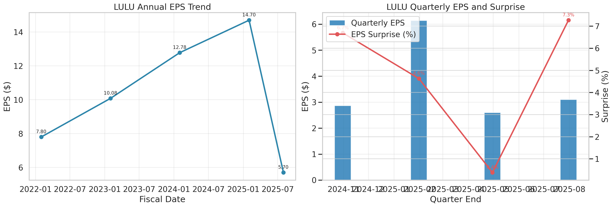
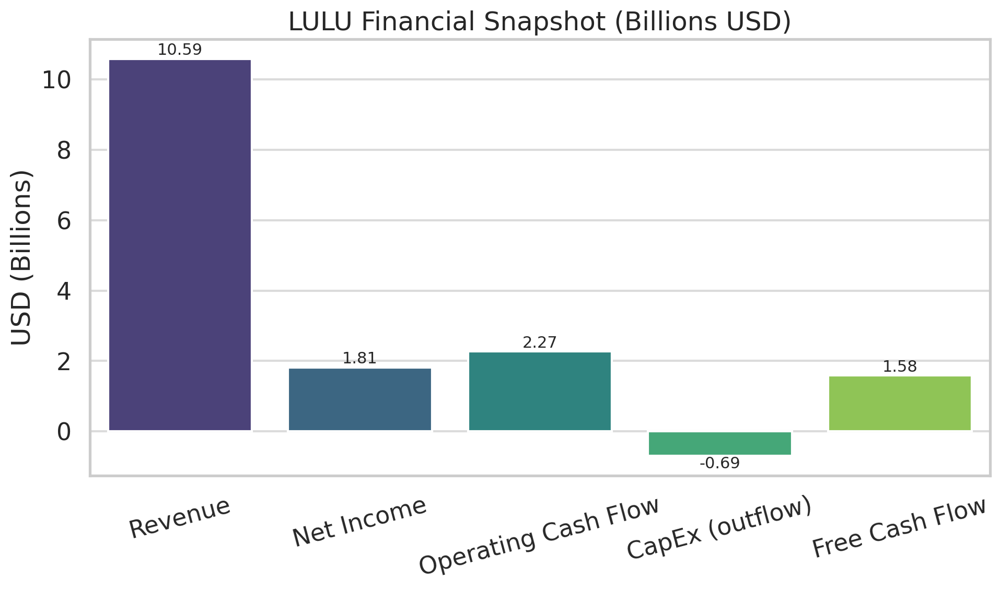
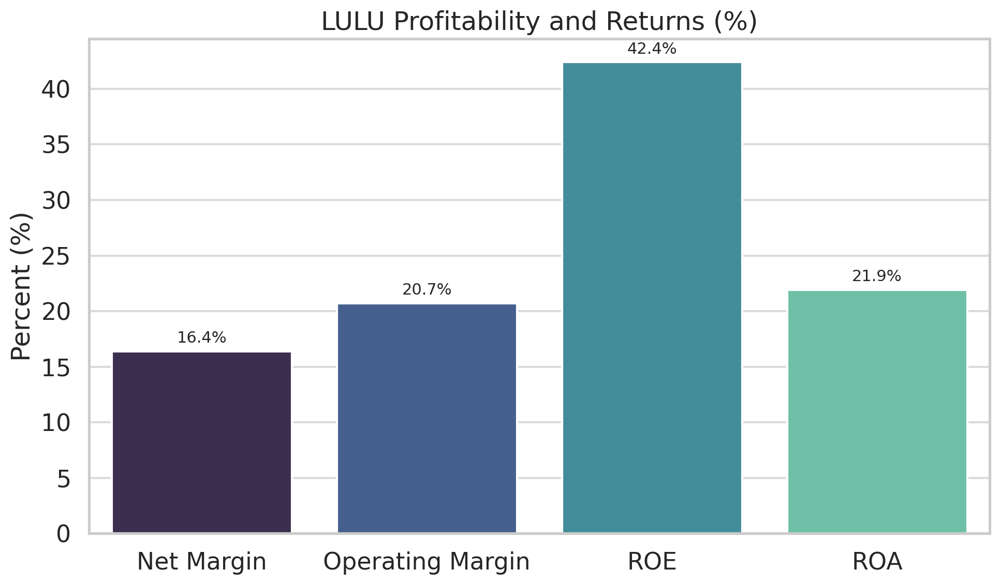
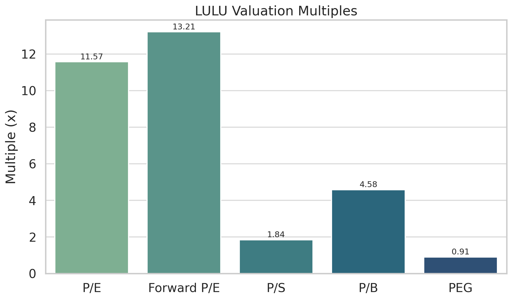

# Financial Market Multi-Agent LangGraph System

An advanced multi-agent architecture using LangGraph for intelligent financial market analysis with sophisticated workflow orchestration.

## 🚀 Features

- **LangGraph-based Orchestration**: Advanced conditional routing and parallel execution
- **Intelligent Agent Selection**: AI-driven workflow decisions based on user intent
- **Rich Visualization**: Built-in execution flow diagrams and performance metrics
- **Comprehensive Analysis**: Financial fundamentals, news, sentiment, and investment recommendations
- **Chart Generation**: Automated financial chart creation using OpenAI Code Interpreter

## 🤖 Agents

- **Analysis Router**: Intelligent user intent classification and workflow routing
- **Ticker Selector**: Extract and validate stock tickers from user queries
- **Fundamentals Agent**: Comprehensive financial metrics analysis
- **News Agent**: Latest financial news and market developments
- **Sentiment Agent**: Market sentiment analysis and opinion mining
- **Advisor Agent**: Professional investment recommendations
- **Code Interpreter**: Automated chart and visualization generation
- **Final Synthesis**: Comprehensive response compilation

## 📊 LangGraph State Schema

Advanced state management defined in `src/langgraph_state.py`:
- **Workflow Metadata**: Execution path, parallel tasks, error tracking
- **Intent Analysis**: User intent classification and complexity scoring
- **Agent State Tracking**: Completion status for each analysis component
- **Rich Output**: Recommendations, charts, news, sentiment, and comprehensive messages

## 🔧 Architecture

```
START → analysis_router → [Conditional Routing]
                         ├── ticker_selector → [Parallel Analysis]
                         ├── fundamentals ∥ news ∥ sentiment
                         ├── advisor → [Optional Visualization]
                         ├── code_interpreter → final_synthesis
                         └── final_synthesis → END
```

## 🚀 Quick Start

```powershell
# Setup environment
python -m venv .venv
.venv\Scripts\Activate.ps1
pip install -r requirements.txt

# Run financial analysis
python run_langgraph_orchestrator.py "Should I invest in Apple? Show me a chart."
python run_langgraph_orchestrator.py "Compare Tesla vs Ford PE ratios"
python run_langgraph_orchestrator.py "Latest news on NVIDIA sentiment"
```

## 📋 Usage Examples

```bash
# Investment advice with visualization
python run_langgraph_orchestrator.py "Should I buy Microsoft stock? Show me their financials in a chart."

# Comparative analysis
python run_langgraph_orchestrator.py "Compare Apple vs Google PE ratios and show me a chart"

# News and sentiment analysis
python run_langgraph_orchestrator.py "What's the latest news on Tesla and market sentiment?"

# Pure visualization
python run_langgraph_orchestrator.py "Create a chart comparing Amazon and Meta revenue growth"
```

### 📊 Sample Analysis Output

**Query:** `"Should I invest in Lululemon for a long term hold, Please also generate a chart with their financials"`

**Generated Charts:**
- 
- 
- 
- 

**Detailed Results:** [View Full Analysis](outputs/langgraph_results_20250922_224118.json)

The system automatically generates multiple complementary visualizations and provides comprehensive JSON output with:
- Complete workflow execution logs
- Financial data and analysis results
- AI-driven recommendations and insights
- Performance metrics and timing data

## 🔍 Output Features

- **Execution Flow Diagrams**: Visual representation of workflow execution
- **Performance Metrics**: Detailed timing, node counts, and efficiency stats
- **Professional Recommendations**: Investment advice with detailed reasoning
- **Automated Charts**: Financial visualizations generated automatically
- **Comprehensive Logging**: Full execution logs exported to JSON
- **Error Handling**: Robust error tracking and recovery

## 📁 Project Structure

```
├── src/
│   ├── agents/                    # Individual agent implementations
│   │   ├── advisor_agent.py      # Investment recommendations
│   │   ├── code_interpreter_agent.py  # Chart generation
│   │   ├── fundamentals_agent.py # Financial metrics
│   │   ├── news_agent.py         # News analysis
│   │   ├── sentiment_agent.py    # Sentiment analysis
│   │   └── ticker_selector_agent.py   # Ticker extraction
│   ├── langgraph_nodes.py        # LangGraph node wrappers
│   ├── langgraph_orchestrator.py # Main workflow orchestrator
│   ├── langgraph_state.py        # Enhanced state management
│   ├── langgraph_visualizer.py   # Workflow visualization tools
│   └── config.py                 # Configuration settings
├── outputs/                      # Analysis results and logs
├── graph/output/                 # Generated charts and images
├── run_langgraph_orchestrator.py # Main execution script
└── requirements.txt              # Dependencies
```

## 🎯 Key Advantages

- **Intelligent Routing**: AI determines optimal workflow based on user intent
- **Parallel Execution**: Independent analyses run simultaneously for better performance
- **Rich State Management**: Comprehensive tracking of execution metadata
- **Built-in Visualization**: Automatic workflow diagrams and performance reports
- **Modular Architecture**: Easy to extend with new agents and capabilities
- **Professional Output**: Investment-grade analysis with detailed reasoning

## 🔧 Configuration

Environment variables (create `.env` file):
```
OPENAI_API_KEY=your_openai_api_key_here
# Add other API keys as needed for news/data sources
```

## 📈 Sample Output

The system provides comprehensive analysis including:
- Professional investment recommendations (Buy/Hold/Sell)
- Detailed financial metrics and ratios
- Automated chart generation
- Risk analysis and key catalysts
- Execution flow visualization
- Performance metrics and timing


## 🤝 Contributing

This system is designed for extensibility. To add new agents:
1. Create agent implementation in `src/agents/`
2. Add LangGraph node wrapper in `src/langgraph_nodes.py`
3. Update routing logic in `langgraph_orchestrator.py`
4. Test with `run_langgraph_orchestrator.py`
